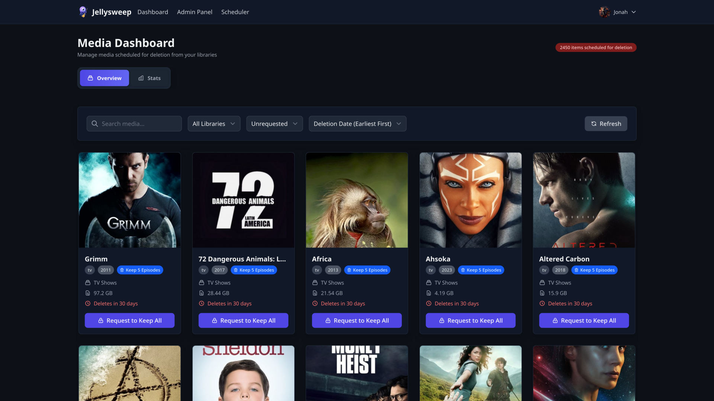
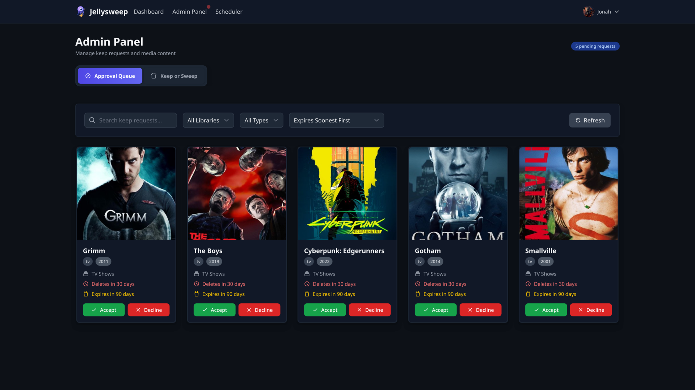

# Jellysweep

[](https://github.com/jon4hz/jellysweep/actions/workflows/ci.yml)
[](https://github.com/jon4hz/jellysweep/actions/workflows/release.yml)
[](https://goreportcard.com/report/github.com/jon4hz/jellysweep)


Jellysweep is a smart cleanup tool for your Jellyfin media server.
It automatically removes old, unwatched movies and TV shows by analyzing your viewing stats and other criteria.
It also supports user requests to keep specific content.

> [!CAUTION]
> Always test with dry-run mode first! And review the logs/dashboard to see what jellysweep would've marked for deletion!


---

## ✨ Key Features

- 🧠 **Smart Analytics** - Checks jellyseerr for requests and Jellystat/Streamystats for stats
- 🏷️ **Tag-Based Control** - Leverage your existing Sonarr/Radarr tags to control jellysweep
- 💾 **Disk Usage Monitoring** - Adaptive cleanup based on disk usage thresholds
- 🧹 **Flexible Cleanup Modes** - Choose how much of TV Series should be deleted
- 📂 **Leaving Collections** - Automatically creates Jellyfin collections showing all media scheduled for deletion
- 👥 **User Requests** - Built-in keep request system for your users
- 🔔 **Notifications** - Send notifications to users and admins
- 📱 **Progressive Web App (PWA)** - Install as an app on mobile and desktop
- 🌐 **Web Interface** - UI to interact with jellysweep


## 📋 Table of Contents

- [Jellysweep](#jellysweep)
  - [✨ Key Features](#-key-features)
  - [📋 Table of Contents](#-table-of-contents)
  - [🚀 How It Works](#-how-it-works)
  - [🔍️ Filters](#️-filters)
  - [🧹 Cleanup Modes](#-cleanup-modes)
  - [💾 Disk Usage-Based Cleanup](#-disk-usage-based-cleanup)
    - [Configuration Example](#configuration-example)
    - [Behavior Examples](#behavior-examples)
  - [📸 Screenshots](#-screenshots)
    - [Dashboard Overview](#dashboard-overview)
    - [Statistics Dashboard](#statistics-dashboard)
    - [Admin Panel - Keep Requests](#admin-panel---keep-requests)
    - [Admin Panel - Keep or Sweep](#admin-panel---keep-or-sweep)
    - [Scheduler Panel](#scheduler-panel)
  - [🔧 Installation](#-installation)
    - [Prerequisites](#prerequisites)
    - [Docker Compose](#docker-compose)
    - [Docker Compose with Valkey Cache](#docker-compose-with-valkey-cache)
  - [🔐 Authentication](#-authentication)
    - [OIDC/SSO Authentication](#oidcsso-authentication)
    - [Jellyfin Authentication](#jellyfin-authentication)
  - [🔔 Web Push Notifications](#-web-push-notifications)
    - [Setup Requirements](#setup-requirements)
  - [⚙️ Configuration](#️-configuration)
    - [Environment Variables](#environment-variables)
    - [Configuration File](#configuration-file)
  - [🔧 Commands](#-commands)
  - [🤝 Contributing](#-contributing)
    - [Development Setup](#development-setup)
  - [📄 License](#-license)

## 🚀 How It Works

Jellysweep looks up your entire media library in jellyfin, sonarr and radarr. Based on different user-defined filers, it then decides which
media items are no longer needed and marks them for deletion by adding special tags in sonarr/radarr.
Your users can then request to keep specific items via the web interface. Admins can review and approve/decline these requests.
Users will receive an email notification, if content that they requested (in jellyseer) is marked for deletion.
After a configurable grace period, the media items are then deleted. There is als an option to speed up the deletion process when disk space is running low.

## 🔍️ Filters

At the core of jellysweep are filters that allow you to define criteria which must be met for a media item to be eligible for deletion.
If one of the filters is not met, the item will be skipped and not marked for deletion.

Filters can be configured per library and include:

| Filter | Description |
|--------|-------------|
| `content_age_threshold` | Minimum age of the content in days |
| `last_stream_threshold` | Minimum days since the content was last streamed |
| `content_size_threshold` | Minimum size of the content in bytes (0 = no minimum) |
| `tunarr_enabled` | Whether to protect items used by Tunarr channels (requires Tunarr configuration) |
| `exclude_tags` | List of Sonarr/Radarr tags that exclude content from deletion |

> [!IMPORTANT]
> Once a media item is marked for deletion, it wont go through the filters again. Filter changes will only affect new items that are being considered for deletion.

## 🧹 Cleanup Modes

Jellysweep supports three different cleanup modes for TV series, configurable globally through the `cleanup_mode` setting. The mode determines how much content is removed when a series is marked for deletion. Movies are always deleted entirely regardless of the cleanup mode.

The `all` mode removes the entire series and all its files, providing maximum storage reclamation. This is the default setting.

The `keep_episodes` mode preserves the first N episodes across all regular seasons while removing everything else. Episodes are counted by their broadcast order, starting from season 1 episode 1, and special episodes in season 0 are always preserved regardless of the count limit.

The `keep_seasons` mode retains complete early seasons while removing later ones. It keeps the first N lowest-numbered regular seasons. Specials will not be deleted in this mode either.

Both selective modes automatically unmonitor deleted episodes in Sonarr to prevent them from being redownloaded. If a series has less or equal amount of episode as the keep policy requests, the series wont be marked from deletion again.

> [!TIP]
> The selective modes in combination with [prefetcharr](https://github.com/p-hueber/prefetcharr) let you automatically scale your media collection on demand.

## 💾 Disk Usage-Based Cleanup

Jellysweep monitors disk usage and speeds up cleanup when you're running low on storage. When disk space is tight, it reduces the grace period for deletions while still giving you time to save anything important during normal operation.


> [!IMPORTANT]
> For disk usage monitoring to work in Docker containers, Jellyfin library paths must be mounted at the same locations inside the Jellysweep container. For example, if Jellyfin has `/data/movies` mapped to `/movies`, Jellysweep also needs `/data/movies` mapped to `/movies`

### Configuration Example

```yaml
libraries:
  "Movies":
    cleanup_delay: 30  # Standard 30-day grace period
    disk_usage_thresholds:
      - usage_percent: 75.0      # When disk usage reaches 75%
        max_cleanup_delay: 14    # Reduce grace period to 14 days
      - usage_percent: 85.0      # When disk usage reaches 85%
        max_cleanup_delay: 7     # Reduce grace period to 7 days
      - usage_percent: 90.0      # When disk usage reaches 90%
        max_cleanup_delay: 3     # Reduce grace period to 3 days
```

### Behavior Examples

Let's say today is 2025-07-26:

- **Disk usage 80%**: Media gets deleted on `2025-08-25` (after 30 days)
- **Disk usage 87%**: Media gets deleted on `2025-08-09` (after 14 days)
- **Disk usage 93%**: Media gets deleted on `2025-08-02` (after 7 days)
- **Disk usage 97%**: Media gets deleted on `2025-07-29` (after 3 days)

---

## 📸 Screenshots

### Dashboard Overview


*Main dashboard showing media items scheduled for deletion with filtering and search capabilities*

### Statistics Dashboard


*Visual analytics showing daily and cumulative storage cleanup over time*

### Admin Panel - Keep Requests


*Admin interface for reviewing and approving user keep requests*

### Admin Panel - Keep or Sweep


*Admin review interface for making final keep/delete decisions on media items*

### Scheduler Panel


*Control scheduler tasks and view cache statistics*

---

## 🔧 Installation

### Prerequisites
- Access to your Jellyfin ecosystem including:
  - Sonarr
  - Radarr
  - Jellystat or Streamystats
  - Jellyseerr


### Docker Compose

For a quick deployment using Docker/Podman, create a `compose.yml` file:

```yaml
services:
  jellysweep:
    image: ghcr.io/jon4hz/jellysweep:latest
    container_name: jellysweep
    restart: unless-stopped
    ports:
      - "3002:3002"
    volumes:
      - ./config.yml:/app/config.yml:ro # use config file or env vars
      - ./data:/app/data
      # Mount Jellyfin library paths at the same locations for disk usage monitoring
      # Example: if Jellyfin has /data/movies, mount it the same way here
      # - /data/movies:/data/movies:ro
      # - /data/tv:/data/tv:ro
    environment:
      # You can also override config options with env vars
      - JELLYSWEEP_DRY_RUN=false
      - JELLYSWEEP_LISTEN=0.0.0.0:3002
    # enable debug logs
    # command:
    #   - serve
    #   - --log-level=debug
```

You can either supply the configuration via a `config.yml` file or use environment variables. Your choice!
If you want to use the config file, make sure to create it before starting the container.

```bash
vim ./config.yml  # or use emacs if you're one of those people.
```

Then run:
```bash

# Start the service
docker compose up -d

# View logs
docker compose logs -f jellysweep

# Reset all tags (cleanup command)
docker compose exec jellysweep ./jellysweep reset
```

### Docker Compose with Valkey Cache

You can also configure valkey as caching backend:

```yaml
services:
  jellysweep:
    image: ghcr.io/jon4hz/jellysweep:latest
    container_name: jellysweep
    ports:
      - "3002:3002"
    volumes:
      - ./config.yml:/app/config.yml:ro # create config file before starting the container!
      - ./data:/app/data
    environment:
      # Cache configuration
      - JELLYSWEEP_CACHE_TYPE=redis
      - JELLYSWEEP_CACHE_REDIS_URL=valkey:6379
      # Other configuration
      - JELLYSWEEP_DRY_RUN=false
      - JELLYSWEEP_LISTEN=0.0.0.0:3002
      # ... add you config here or use the config file!
    restart: unless-stopped
    depends_on:
      - valkey
    networks:
      - jellyfin-network

  valkey:
    image: valkey/valkey:8-alpine
    container_name: jellysweep-valkey
    restart: unless-stopped

```

---

## 🔐 Authentication

Jellysweep supports multiple authentication methods to secure your web interface:

### OIDC/SSO Authentication

- **Tested Providers**: Authentik

Make sure to add a `group` claim to your OIDC token.

**Configuration:**
```yaml
auth:
  oidc:
    enabled: true
    name: Authentik
    issuer: "https://your-sso-provider.com/application/o/jellysweep/"
    client_id: "your-client-id"
    client_secret: "your-client-secret"
    redirect_url: "http://localhost:3002/auth/oidc/callback"
    admin_group: "jellyfin-admins"       # Users in this group get admin access
    auto_approve_group: "vip-users"      # (Optional) Users in this group get automatic approval for keep requests
```

**User Permissions:**

- **Admin Access**: Users who are members of the `admin_group` will have full administrative privileges in Jellysweep.

- **Auto-Approve Permission**: Users who are members of the `auto_approve_group` will have their keep requests automatically approved.

  The auto-approve permission is synchronized with the OIDC group membership on each login. This means:
  - When a user logs in and is in the `auto_approve_group`, they get auto-approve permission
  - When a user logs in and is NOT in the `auto_approve_group`, they lose auto-approve permission
  - Admins can still manually grant/revoke auto-approve permission via the admin panel, but it will be overwritten on the user's next login if `auto_approve_group` is configured


### Jellyfin Authentication

Use your jellyfin server as authentication provider. All jellyfin admins will get admin access in jellysweep as well.

**Configuration:**
```yaml
auth:
  jellyfin:
    enabled: true
    url: "http://localhost:8096"  # Your Jellyfin server URL
```

> [!NOTE]
> When using Jellyfin authentication, user permissions must be managed manually by admins through the web interface.


---

## 🔔 Web Push Notifications

Users can subscribe to web push notifications to get notified when their keep requests get approved or declined.
Web push notifications must be explicitly enabled by every user.
This works on every device that supports PWAs (Progressive Web Apps).

### Setup Requirements

**Generate VAPID Keys**:
```bash
# Generate VAPID keys using the built-in command
jellysweep generate-vapid-keys

# or using docker
docker run --rm ghcr.io/jon4hz/jellysweep:latest generate-vapid-keys

```

**Configuration:**
```yaml
webpush:
  enabled: true
  vapid_email: "your-email@example.com"     # Contact email for push service
  public_key: "BMgM07-9XLObs5DGk89rBaT..."  # VAPID public key
  private_key: "dZ-lxXpoCNqyfdfojVt51t..."  # VAPID private key
```

---

## ⚙️ Configuration

Jellysweep supports configuration through YAML files and environment variables. Environment variables use the `JELLYSWEEP_` prefix and follow the configuration structure with underscores (e.g., `JELLYSWEEP_DRY_RUN`).

### Environment Variables

All configuration options can be set via environment variables with the `JELLYSWEEP_` prefix:

| Environment Variable | Default Value | Description |
|---------------------|---------------|-------------|
| **Jellysweep Server** | | |
| `JELLYSWEEP_LISTEN` | `0.0.0.0:3002` | Address and port for the web interface |
| `JELLYSWEEP_CLEANUP_SCHEDULE` | `0 */12 * * *` | Cron schedule for cleanup runs |
| `JELLYSWEEP_CLEANUP_MODE` | `all` | Cleanup mode: `all`, `keep_episodes`, or `keep_seasons` |
| `JELLYSWEEP_KEEP_COUNT` | `1` | Number of episodes/seasons to keep (when using `keep_episodes` or `keep_seasons` mode) |
| `JELLYSWEEP_DRY_RUN` | `true` | Run in dry-run mode (no actual deletions) |
| `JELLYSWEEP_API_KEY` | *(optional)* | API key for the Jellysweep server (used by the Jellyfin plugin) |
| `JELLYSWEEP_SESSION_KEY` | *(required)* | Random string for session encryption (`openssl rand -base64 32`) |
| `JELLYSWEEP_SESSION_MAX_AGE` | `172800` | Session maximum age in seconds (48 hours) |
| `JELLYSWEEP_SERVER_URL` | `http://localhost:3002` | Base URL of the Jellysweep server |
| **Leaving Collections** | | |
| `JELLYSWEEP_LEAVING_COLLECTIONS_ENABLED` | `false` | | Enable leaving collections for media scheduled for deletion |
| `JELLYSWEEP_LEAVING_COLLECTIONS_MOVIE_NAME` | `Leaving Movies` | Name of the leaving movies collection |
| `JELLYSWEEP_LEAVING_COLLECTIONS_TV_NAME` | `Leaving TV Shows` | Name of the leaving TV shows collection |
| **Database Configuration** | | |
| `JELLYSWEEP_DATABASE_PATH` | `./data/jellysweep.db` | Path to the database file |
| **OIDC Authentication** | | |
| `JELLYSWEEP_AUTH_OIDC_ENABLED` | `false` | Enable OIDC/SSO authentication |
| `JELLYSWEEP_AUTH_OIDC_NAME` | OIDC | Display name on the login page |
| `JELLYSWEEP_AUTH_OIDC_ISSUER` | *(required if OIDC enabled)* | OIDC issuer URL |
| `JELLYSWEEP_AUTH_OIDC_CLIENT_ID` | *(required if OIDC enabled)* | OIDC client ID |
| `JELLYSWEEP_AUTH_OIDC_CLIENT_SECRET` | *(required if OIDC enabled)* | OIDC client secret |
| `JELLYSWEEP_AUTH_OIDC_REDIRECT_URL` | *(required if OIDC enabled)* | OIDC redirect URL |
| `JELLYSWEEP_AUTH_OIDC_USE_PKCE` | `false` | Enable PKCE for enhanced security |
| `JELLYSWEEP_AUTH_OIDC_ADMIN_GROUP` | *(required if OIDC enabled)* | Group with admin privileges |
| `JELLYSWEEP_AUTH_OIDC_AUTO_APPROVE_GROUP` | *(optional)* | Group with auto-approval permission for keep requests |
| **Jellyfin Authentication** | | |
| `JELLYSWEEP_AUTH_JELLYFIN_ENABLED` | `true` | Enable Jellyfin authentication |
| **Profile Pictures** | | |
| `JELLYSWEEP_GRAVATAR_ENABLED` | `false` | Enable Gravatar profile pictures |
| `JELLYSWEEP_GRAVATAR_DEFAULT_IMAGE` | `robohash` | Default image if no Gravatar found |
| `JELLYSWEEP_GRAVATAR_RATING` | `g` | Maximum rating for images (g, pg, r, x) |
| `JELLYSWEEP_GRAVATAR_SIZE` | `80` | Image size in pixels (1-2048) |
| **Email Notifications** | | |
| `JELLYSWEEP_EMAIL_ENABLED` | `false` | Enable email notifications |
| `JELLYSWEEP_EMAIL_SMTP_HOST` | *(required if email enabled)* | SMTP server host |
| `JELLYSWEEP_EMAIL_SMTP_PORT` | `587` | SMTP server port |
| `JELLYSWEEP_EMAIL_USERNAME` | *(required if email enabled)* | SMTP username |
| `JELLYSWEEP_EMAIL_PASSWORD` | *(required if email enabled)* | SMTP password |
| `JELLYSWEEP_EMAIL_FROM_EMAIL` | *(required if email enabled)* | From email address |
| `JELLYSWEEP_EMAIL_FROM_NAME` | `Jellysweep` | From name for emails |
| `JELLYSWEEP_EMAIL_USE_TLS` | `true` | Use TLS for SMTP connection |
| `JELLYSWEEP_EMAIL_USE_SSL` | `false` | Use SSL for SMTP connection |
| `JELLYSWEEP_EMAIL_INSECURE_SKIP_VERIFY` | `false` | Skip TLS certificate verification |
| **Ntfy Notifications** | | |
| `JELLYSWEEP_NTFY_ENABLED` | `false` | Enable ntfy notifications |
| `JELLYSWEEP_NTFY_SERVER_URL` | `https://ntfy.sh` | Ntfy server URL |
| `JELLYSWEEP_NTFY_TOPIC` | *(required if ntfy enabled)* | Ntfy topic to publish to |
| `JELLYSWEEP_NTFY_USERNAME` | *(optional)* | Ntfy username for authentication |
| `JELLYSWEEP_NTFY_PASSWORD` | *(optional)* | Ntfy password for authentication |
| `JELLYSWEEP_NTFY_TOKEN` | *(optional)* | Ntfy token for authentication |
| **Web Push Notifications** | | |
| `JELLYSWEEP_WEBPUSH_ENABLED` | `false` | Enable web push notifications |
| `JELLYSWEEP_WEBPUSH_VAPID_EMAIL` | *(required if webpush enabled)* | Contact email for VAPID keys |
| `JELLYSWEEP_WEBPUSH_PUBLIC_KEY` | *(required if webpush enabled)* | VAPID public key |
| `JELLYSWEEP_WEBPUSH_PRIVATE_KEY` | *(required if webpush enabled)* | VAPID private key |
| **External Services** | | |
| `JELLYSWEEP_JELLYSEERR_URL` | *(required)* | Jellyseerr server URL |
| `JELLYSWEEP_JELLYSEERR_API_KEY` | *(required)* | Jellyseerr API key |
| `JELLYSWEEP_SONARR_URL` | *(optional)* | Sonarr server URL |
| `JELLYSWEEP_SONARR_API_KEY` | *(optional)* | Sonarr API key |
| `JELLYSWEEP_RADARR_URL` | *(optional)* | Radarr server URL |
| `JELLYSWEEP_RADARR_API_KEY` | *(optional)* | Radarr API key |
| `JELLYSWEEP_JELLYFIN_URL` | *(required)* | Jellyfin server URL |
| `JELLYSWEEP_JELLYFIN_API_KEY` | *(required)* | Jellyfin API key |
| `JELLYSWEEP_JELLYSTAT_URL` | *(optional)* | Jellystat server URL |
| `JELLYSWEEP_JELLYSTAT_API_KEY` | *(optional)* | Jellystat API key |
| `JELLYSWEEP_STREAMYSTATS_URL` | *(optional)* | Streamystats server URL |
| `JELLYSWEEP_STREAMYSTATS_SERVER_ID` | *(optional)* | Streamystats Jellyfin server ID |
| `JELLYSWEEP_TUNARR_URL` | *(optional)* | Tunarr server URL |
| **Cache Configuration** | | |
| `JELLYSWEEP_CACHE_TYPE` | `memory` | Cache type: `memory` or `redis` |
| `JELLYSWEEP_CACHE_REDIS_URL` | `localhost:6379` | Redis server URL (when using redis cache) |

> [!TIP]
> Either Sonarr or Radarr (or both) must be configured. Only one of Jellystat or Streamystats can be configured at a time.

> [!IMPORTANT]
> The library configuration cannot be set via environment variables and must be defined in the configuration file.
.

### Configuration File

Jellysweep uses a YAML configuration file with the following structure:

```yaml
dry_run: false                   # Set to true for testing
listen: "0.0.0.0:3002"           # Web interface address and port
cleanup_schedule: "0 */12 * * *" # Every 12 hours
cleanup_mode: "keep_seasons"     # Cleanup mode: "all", "keep_episodes", or "keep_seasons"
keep_count: 1                    # Number of episodes/seasons to keep (when using keep_episodes or keep_seasons)
api_key: ""                      # Optional: API key for Jellyfin plugin integration
session_key: "your-session-key"  # Random string for session encryption
session_max_age: 172800          # Session max age in seconds (48 hours)
server_url: "http://localhost:3002"

# Database configuration (optional)
database:
  path: "./data/jellysweep.db"

# Authentication (optional - if no auth is configured, web interface is accessible without authentication)
auth:
  # OpenID Connect (OIDC) Authentication
  oidc:
    enabled: false
    name: OIDC
    issuer: "https://login.mydomain.com/application/o/jellysweep/"
    client_id: "your-client-id"
    client_secret: "your-client-secret"
    redirect_url: "http://localhost:3002/auth/oidc/callback"
    use_pkce: true                     # Use PKCE for enhanced security
    admin_group: "jellyfin-admins"     # OIDC group for admin access
    auto_approve_group: "vip-users"    # (Optional) OIDC group for auto-approval of keep requests

  # Jellyfin Authentication
  jellyfin:
    enabled: true                      # Default authentication method

# Jellyfin server configuration
jellyfin:
  url: "http://localhost:8096"         # Your Jellyfin server URL
  api_key: "your-jellyfin-api-key"     # Jellyfin API key

# Profile Pictures (optional)
gravatar:
  enabled: false                       # Enable Gravatar profile pictures
  default_image: "mp"                  # Default image if no Gravatar found
                                       # Options: "404", "mp", "identicon", "monsterid",
                                       #          "wavatar", "retro", "robohash", "blank"
  rating: "g"                          # Maximum rating for images
                                       # Options: "g", "pg", "r", "x"
  size: 80                             # Image size in pixels (1-2048)

leaving_collections_enabled: true      # Create collections for media scheduled for deletion
leaving_collections_movie_name: "Leaving Movies"
leaving_collections_tv_name: "Leaving TV Shows"

# Library-specific settings
libraries:

  "Movies":
    enabled: true
    cleanup_delay: 60
    protection_period: 90         # Protect requested content for 90 days
    # Filter configuration
    filter:
      content_age_threshold: 120        # Content must be at least 120 days old
      last_stream_threshold: 90         # Last watched at least 90 days ago
      content_size_threshold: 1073741824  # 1GB minimum (0 = no minimum)
      tunarr_enabled: true              # Protect items used by Tunarr channels (requires tunarr config)
      exclude_tags:
        - "jellysweep-exclude"
        - "keep"
        - "favorites"
    # Disk usage-based cleanup for movies
    disk_usage_thresholds:
      - usage_percent: 70.0       # When disk usage reaches 70%
        max_cleanup_delay: 30     # Reduce grace period to 30 days
      - usage_percent: 85.0       # When disk usage reaches 85%
        max_cleanup_delay: 14      # Reduce grace period to 14 days
      - usage_percent: 90.0       # When disk usage reaches 90%
        max_cleanup_delay: 7      # Reduce grace period to 7 days
      - usage_percent: 95.0       # When disk usage reaches 95%
        max_cleanup_delay: 2      # Reduce grace period to 2 days

  "TV Shows":
    enabled: true
    cleanup_delay: 60
    protection_period: 90
    # Filter configuration
    filter:
      content_age_threshold: 120
      last_stream_threshold: 90
      content_size_threshold: 2147483648  # 2GB minimum
      tunarr_enabled: false             # Disable Tunarr filter for this library
      exclude_tags:
        - "jellysweep-exclude"
        - "ongoing"
        - "keep"
    # Disk usage-based cleanup for TV shows
    disk_usage_thresholds:
      - usage_percent: 70.0
        max_cleanup_delay: 30
      - usage_percent: 85.0
        max_cleanup_delay: 14
      - usage_percent: 90.0
        max_cleanup_delay: 7
      - usage_percent: 95.0
        max_cleanup_delay: 2

# Email notifications for users about upcoming deletions
email:
  enabled: false
  smtp_host: "mail.example.com"
  smtp_port: 587
  username: "your-smtp-username"
  password: "your-smtp-password"
  from_email: "jellysweep@example.com"
  from_name: "Jellysweep"
  use_tls: true              # Use STARTTLS
  use_ssl: false             # Use SSL/TLS
  insecure_skip_verify: false

# Ntfy notifications for admins about keep requests and deletions
ntfy:
  enabled: false
  server_url: "https://ntfy.sh"  # Or your own ntfy server
  topic: "jellysweep"
  # Authentication options (choose one):
  username: ""               # Username/password auth
  password: ""
  token: ""                  # Token auth (takes precedence)

# Web push notifications
webpush:
  enabled: false
  vapid_email: "your-email@example.com"  # Contact email for VAPID keys
  public_key: ""                         # VAPID public key
  private_key: ""                        # VAPID private key

# External service integrations
jellyseerr:
  url: "http://localhost:5055"
  api_key: "your-jellyseerr-api-key"

sonarr:
  url: "http://localhost:8989"
  api_key: "your-sonarr-api-key"

radarr:
  url: "http://localhost:7878"
  api_key: "your-radarr-api-key"

jellystat:
  url: "http://localhost:3001"
  api_key: "your-jellystat-api-key"

# Alternative to Jellystat (configure only one)
streamystats:
  url: "http://localhost:3001"
  server_id: 1                         # Jellyfin server ID in Streamystats

# Tunarr (optional)
# Protect items that are used by Tunarr TV channels. When configured, Jellysweep will
# fetch channel programming and skip deletion for any movie or series that is
# currently used by a Tunarr program.
#
tunarr:
  url: "http://localhost:8000"

# Cache configuration (optional - improves performance for large libraries)
cache:
  enabled: true                  # Enable caching system
  type: "memory"                 # Options: "memory", "redis"
  redis_url: "localhost:6379"    # Redis server URL (when using redis cache)
```

---

## 🔧 Commands

```bash
# Start the main service
jellysweep serve

# Start with specific configuration file
jellysweep serve --config /path/to/config.yml

# Reset all Jellysweep tags
jellysweep reset

# Generate VAPID keys for web push notifications
jellysweep generate-vapid-keys

# Full command help
jellysweep --help
```

---

## 🤝 Contributing

Contributions of all kinds are welcome!

### Development Setup
```bash
git clone https://github.com/yourusername/jellysweep.git
cd jellysweep
nvm install
npm install --include=dev
go mod download

# Install pre-commit hooks (recommended)
pip install pre-commit
pre-commit install

# lint
golangci-lint run

# run tests
go test -v ./...

# build dependencies and generate templ code
make build

# run the service with debug logging
go run . serve --log-level debug
```

**Pre-commit Hooks**

This project uses pre-commit hooks to ensure code quality and consistency.
If you want to contribute, please install the pre-commit package and run `pre-commit install` in the project root.

---

## 📄 License

This project is licensed under the GPLv3 License - see the [LICENSE](LICENSE) file for details.
