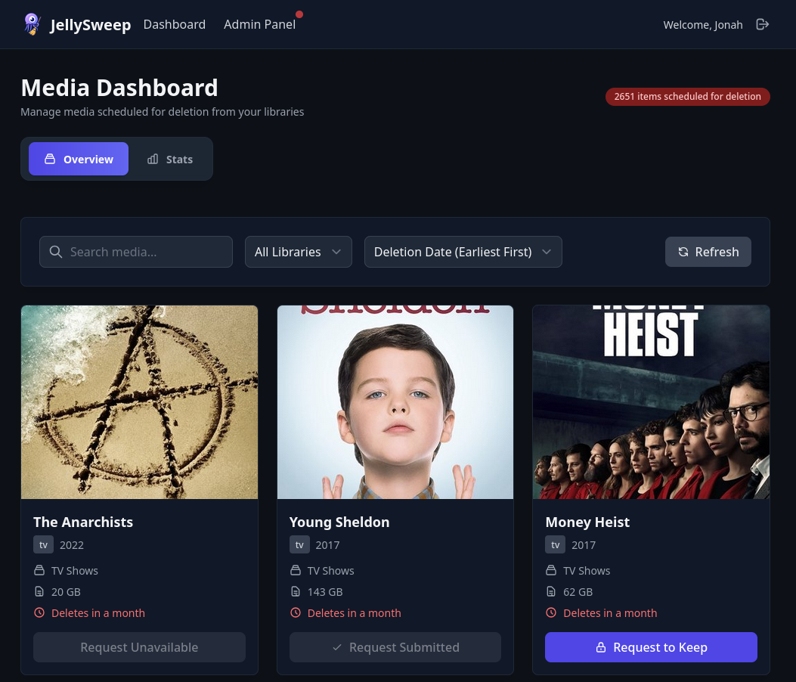
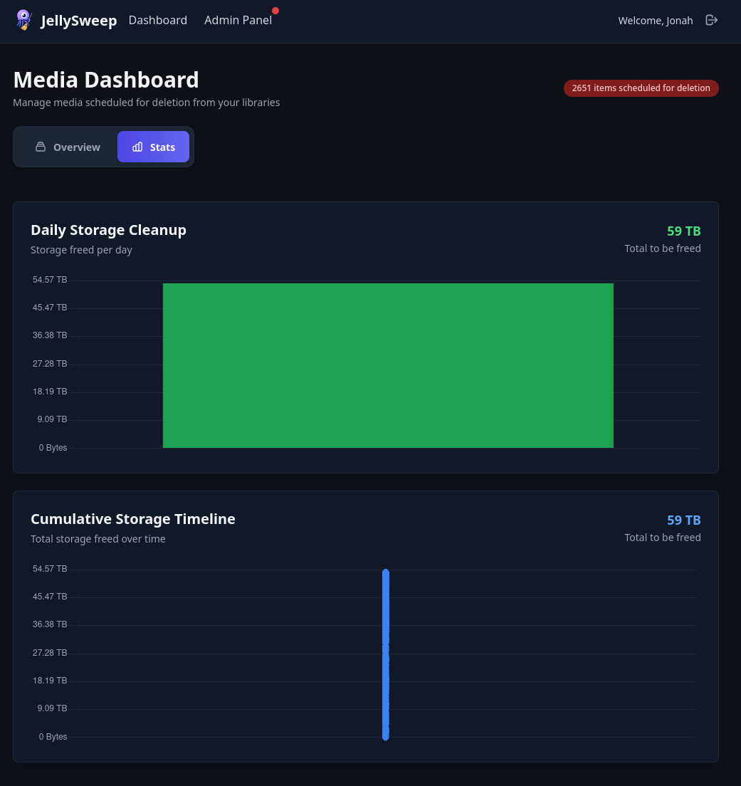
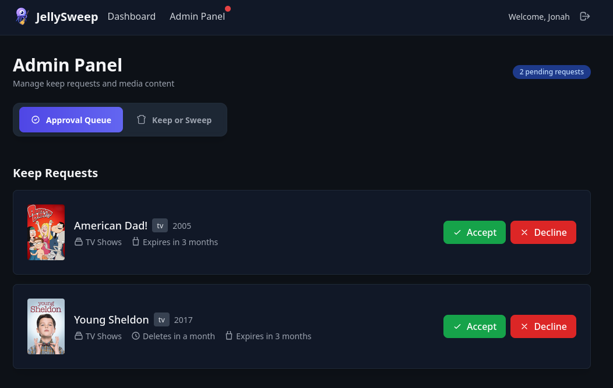
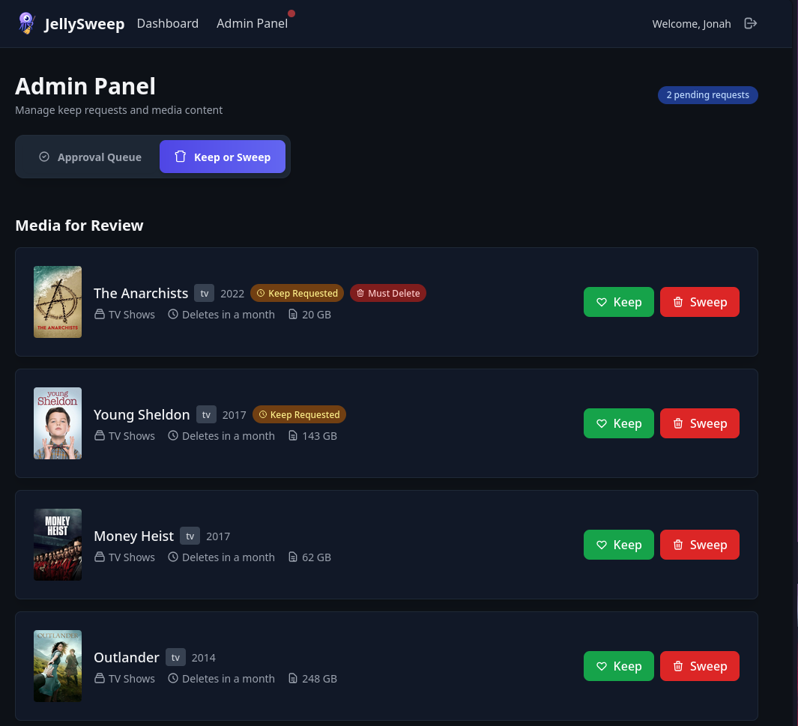

# 🧹🪼 JellySweep

[](https://github.com/jon4hz/jellysweep/actions/workflows/ci.yml)
[](https://github.com/jon4hz/jellysweep/actions/workflows/release.yml)
[](https://goreportcard.com/report/github.com/jon4hz/jellysweep)


JellySweep is a smart cleanup tool for your Jellyfin media server.  
It automatically removes old, unwatched movies and TV shows by analyzing your viewing history and user requests.

> [!CAUTION]  
> Always test with dry-run mode first!  
> JellySweep is powerful - configure it correctly!


---

## ✨ Key Features

- 🧠 **Smart Analytics** - Checks jellyseerr for requests and Jellystat of stats
- 🏷️ **Tag-Based Control** - Leverage your existing Sonarr/Radarr tags to control jellysweep
- 👥 **User Requests** - Built-in keep request system for your users
- 🔔 **Notifications** - Email users and ntfy alerts for admins
- ⚡ **Stateless Design** - No database required, clean runs every time
- 🌐 **Web Interface** - Modern UI for monitoring and management
- 📊 **Statistics Dashboard** - Visual charts showing cleanup progress and storage freed


## 📋 Table of Contents

- [🧹🪼 JellySweep](#-jellysweep)
  - [✨ Key Features](#-key-features)
  - [📋 Table of Contents](#-table-of-contents)
  - [🚀 How It Works](#-how-it-works)
  - [📸 Screenshots](#-screenshots)
    - [Dashboard Overview](#dashboard-overview)
    - [Statistics Dashboard](#statistics-dashboard)
    - [Admin Panel - Keep Requests](#admin-panel---keep-requests)
    - [Admin Panel - Keep or Sweep](#admin-panel---keep-or-sweep)
  - [🔧 Installation](#-installation)
    - [Prerequisites](#prerequisites)
    - [Quick Start](#quick-start)
    - [Docker Compose](#docker-compose)
  - [🔐 Authentication](#-authentication)
    - [OIDC/SSO Authentication](#oidcsso-authentication)
    - [Jellyfin Authentication](#jellyfin-authentication)
  - [⚙️ Configuration](#️-configuration)
    - [Environment Variables](#environment-variables)
    - [Configuration File](#configuration-file)
  - [🏷️ Tag System](#️-tag-system)
    - [Automatic Tags](#automatic-tags)
    - [Custom Tags](#custom-tags)
  - [🔧 Commands](#-commands)
  - [🤝 Contributing](#-contributing)
    - [Development Setup](#development-setup)
  - [📄 License](#-license)

## 🚀 How It Works
1. **Data Collection**
   - Fetches media from Sonarr & Radarr
   - Retrieves viewing statistics from Jellystat
   - Analyzes request history from Jellyseerr
   - Maps media across libraries and services

2. **Media Filtering**
   - Applies configurable age thresholds
   - Respects custom exclude tags
   - Respects user keep requests

3. **Delayed Deletion**
   - Marks media with dated deletion tags
   - Provides grace period for objections
   - Removes recently played content from deletion queue
   - Executes final cleanup after delay

4. **User Interaction**
   - Users can request to keep specific media
   - Admins can approve/decline requests
   - Automatic cleanup of expired requests
   - Force deletion override for admins

---

## 📸 Screenshots

### Dashboard Overview

*Main dashboard showing media items scheduled for deletion with filtering and search capabilities*

### Statistics Dashboard

*Visual analytics showing daily and cumulative storage cleanup over time*

### Admin Panel - Keep Requests

*Admin interface for reviewing and approving user keep requests*

### Admin Panel - Keep or Sweep

*Admin review interface for making final keep/delete decisions on media items*

---

## 🔧 Installation

### Prerequisites
- Access to your Jellyfin ecosystem including:
  - Sonarr
  - Radarr
  - Jellystat
  - Jellyseerr

### Quick Start

1. **Download & Build**
   ```bash
   git clone https://github.com/yourusername/jellysweep.git
   cd jellysweep
   go build -o jellysweep .
   ```

2. **Configuration**
   ```bash
   cp config.example.yml config.yml
   # Edit config.yml with your service URLs and API keys
   ```

3. **Run**
   ```bash
   # Start the service
   ./jellysweep serve
   
   # Reset all tags (cleanup command)
   ./jellysweep reset
   ```

### Docker Compose

For a quick deployment using Docker/Podman, create a `compose.yml` file:

```yaml
services:
  jellysweep:
    image: ghcr.io/jon4hz/jellysweep:latest
    container_name: jellysweep
    ports:
      - "3002:3002"
    volumes:
      # - ./config.yml:/app/config.yml:ro use config or env vars
      - ./data:/app/data
    environment:
      # Override config values via environment variables if needed
      - JELLYSWEEP_DRY_RUN=false
      - JELLYSWEEP_LISTEN=0.0.0.0:3002
    restart: unless-stopped
    networks:
      jellyfin-network:

networks:
  jellyfin-network:
    external: true  # Assumes you have a shared network with your Jellyfin stack
```

Then run:
```bash

# Start the service
docker compose up -d

# View logs
docker compose logs -f jellysweep

# Reset all tags (cleanup command)
docker compose exec jellysweep ./jellysweep reset
```

---

## 🔐 Authentication

JellySweep supports multiple authentication methods to secure your web interface:

### OIDC/SSO Authentication

- **Tested Providers**: Authentik
- **Group-based Admin Access**: Read admin groups from `group` claim.
- **Single Sign-On**: Users authenticate once and access JellySweep seamlessly

**Configuration:**
```yaml
auth:
  oidc:
    enabled: true
    issuer: "https://your-sso-provider.com/application/o/jellysweep/"
    client_id: "your-client-id"
    client_secret: "your-client-secret"
    redirect_url: "http://localhost:3002/auth/oidc/callback"
    admin_group: "jellyfin-admins"  # Users in this group get admin access
```

### Jellyfin Authentication

- **Direct Integration**: Leverages your existing Jellyfin user database
- **Admin Detection**: Jellyfin administrators automatically get admin access in JellySweep
- **No Additional Setup**: Works out of the box with your Jellyfin instance
- **Form-based Login**: Traditional username/password login form
- **Admin Access**: All Jellyfin admins will have access to the admin panel

**Configuration:**
```yaml
auth:
  jellyfin:
    enabled: true
    url: "http://localhost:8096"  # Your Jellyfin server URL
```

---

## ⚙️ Configuration

JellySweep supports configuration through YAML files and environment variables. Environment variables use the `JELLYSWEEP_` prefix and follow the configuration structure with underscores (e.g., `JELLYSWEEP_DRY_RUN`).

### Environment Variables

All configuration options can be set via environment variables with the `JELLYSWEEP_` prefix:

| Environment Variable | Default Value | Description |
|---------------------|---------------|-------------|
| **JellySweep Server** | | |
| `JELLYSWEEP_LISTEN` | `0.0.0.0:3002` | Address and port for the web interface |
| `JELLYSWEEP_CLEANUP_INTERVAL` | `12` | Hours between automatic cleanup runs |
| `JELLYSWEEP_DRY_RUN` | `false` | Run in dry-run mode (no actual deletions) |
| `JELLYSWEEP_SESSION_KEY` | *(required)* | Random string for session encryption (`openssl rand -base64 32`) |
| `JELLYSWEEP_SESSION_MAX_AGE` | `172800` | Session maximum age in seconds (48 hours) |
| `JELLYSWEEP_SERVER_URL` | `http://localhost:3002` | Base URL of the JellySweep server |
| **OIDC Authentication** | | |
| `JELLYSWEEP_AUTH_OIDC_ENABLED` | `false` | Enable OIDC/SSO authentication |
| `JELLYSWEEP_AUTH_OIDC_ISSUER` | *(required if OIDC enabled)* | OIDC issuer URL |
| `JELLYSWEEP_AUTH_OIDC_CLIENT_ID` | *(required if OIDC enabled)* | OIDC client ID |
| `JELLYSWEEP_AUTH_OIDC_CLIENT_SECRET` | *(required if OIDC enabled)* | OIDC client secret |
| `JELLYSWEEP_AUTH_OIDC_REDIRECT_URL` | *(required if OIDC enabled)* | OIDC redirect URL |
| `JELLYSWEEP_AUTH_OIDC_ADMIN_GROUP` | *(required if OIDC enabled)* | Group with admin privileges |
| **Jellyfin Authentication** | | |
| `JELLYSWEEP_AUTH_JELLYFIN_ENABLED` | `true` | Enable Jellyfin authentication |
| `JELLYSWEEP_AUTH_JELLYFIN_URL` | *(required if Jellyfin auth enabled)* | Jellyfin server URL |
| **Email Notifications** | | |
| `JELLYSWEEP_EMAIL_ENABLED` | `false` | Enable email notifications |
| `JELLYSWEEP_EMAIL_SMTP_HOST` | *(required if email enabled)* | SMTP server host |
| `JELLYSWEEP_EMAIL_SMTP_PORT` | `587` | SMTP server port |
| `JELLYSWEEP_EMAIL_USERNAME` | *(required if email enabled)* | SMTP username |
| `JELLYSWEEP_EMAIL_PASSWORD` | *(required if email enabled)* | SMTP password |
| `JELLYSWEEP_EMAIL_FROM_EMAIL` | *(required if email enabled)* | From email address |
| `JELLYSWEEP_EMAIL_FROM_NAME` | `JellySweep` | From name for emails |
| `JELLYSWEEP_EMAIL_USE_TLS` | `true` | Use TLS for SMTP connection |
| `JELLYSWEEP_EMAIL_USE_SSL` | `false` | Use SSL for SMTP connection |
| `JELLYSWEEP_EMAIL_INSECURE_SKIP_VERIFY` | `false` | Skip TLS certificate verification |
| **Ntfy Notifications** | | |
| `JELLYSWEEP_NTFY_ENABLED` | `false` | Enable ntfy notifications |
| `JELLYSWEEP_NTFY_SERVER_URL` | `https://ntfy.sh` | Ntfy server URL |
| `JELLYSWEEP_NTFY_TOPIC` | *(required if ntfy enabled)* | Ntfy topic to publish to |
| `JELLYSWEEP_NTFY_USERNAME` | *(optional)* | Ntfy username for authentication |
| `JELLYSWEEP_NTFY_PASSWORD` | *(optional)* | Ntfy password for authentication |
| `JELLYSWEEP_NTFY_TOKEN` | *(optional)* | Ntfy token for authentication |
| **Default Library Settings** | | |
| `JELLYSWEEP_LIBRARIES_DEFAULT_ENABLED` | `true` | Enable cleanup for default library |
| `JELLYSWEEP_LIBRARIES_DEFAULT_REQUEST_AGE_THRESHOLD` | `120` | Min age in days for requests to be eligible |
| `JELLYSWEEP_LIBRARIES_DEFAULT_LAST_STREAM_THRESHOLD` | `90` | Min days since last stream for cleanup |
| `JELLYSWEEP_LIBRARIES_DEFAULT_CLEANUP_DELAY` | `30` | Days before deletion after marking |
| **External Services** | | |
| `JELLYSWEEP_JELLYSEERR_URL` | *(required)* | Jellyseerr server URL |
| `JELLYSWEEP_JELLYSEERR_API_KEY` | *(required)* | Jellyseerr API key |
| `JELLYSWEEP_SONARR_URL` | *(optional)* | Sonarr server URL |
| `JELLYSWEEP_SONARR_API_KEY` | *(optional)* | Sonarr API key |
| `JELLYSWEEP_RADARR_URL` | *(optional)* | Radarr server URL |
| `JELLYSWEEP_RADARR_API_KEY` | *(optional)* | Radarr API key |
| `JELLYSWEEP_JELLYSTAT_URL` | *(optional)* | Jellystat server URL |
| `JELLYSWEEP_JELLYSTAT_API_KEY` | *(optional)* | Jellystat API key |

> **Note**: Either Sonarr or Radarr (or both) must be configured. If no authentication methods are enabled, the web interface will be accessible without authentication (recommended for development only).

### Configuration File

JellySweep uses a YAML configuration file with the following structure:

```yaml
dry_run: false                   # Set to true for testing
listen: "0.0.0.0:3002"           # Web interface address and port
cleanup_interval: 12             # Hours between cleanup runs
session_key: "your-session-key"  # Random string for session encryption
session_max_age: 172800          # Session max age in seconds (48 hours)
server_url: "http://localhost:3002"

# Authentication (optional - if no auth is configured, web interface is accessible without authentication)
# Warning: No authentication is only recommended for development environments
auth:
  # OpenID Connect (OIDC) Authentication
  oidc:
    enabled: false
    issuer: "https://login.mydomain.com/application/o/jellysweep/"
    client_id: "your-client-id"
    client_secret: "your-client-secret"
    redirect_url: "http://localhost:3002/auth/oidc/callback"
    admin_group: "jellyfin-admins"     # OIDC group for admin access
  
  # Jellyfin Authentication
  jellyfin:
    enabled: true                      # Default authentication method
    url: "http://localhost:8096"       # Your Jellyfin server URL

# Library-specific settings
libraries:
  default:
    enabled: true
    request_age_threshold: 120    # Days since Jellyseerr request
    last_stream_threshold: 90     # Days since last viewed
    cleanup_delay: 30             # Grace period before deletion
    exclude_tags:
      - "jellysweep-exclude"
      - "jellysweep-ignore"
      - "do-not-delete"
  
  "Movies":
    enabled: true
    request_age_threshold: 120
    last_stream_threshold: 90
    cleanup_delay: 30
    exclude_tags:
      - "jellysweep-exclude"
      - "keep"
      - "favorites"
  
  "TV Shows":
    enabled: true
    request_age_threshold: 120
    last_stream_threshold: 90
    cleanup_delay: 30
    exclude_tags:
      - "jellysweep-exclude"
      - "ongoing"
      - "keep"
  
# Email notifications for users about upcoming deletions
email:
  enabled: false
  smtp_host: "mail.example.com"
  smtp_port: 587
  username: "your-smtp-username"
  password: "your-smtp-password"
  from_email: "jellysweep@example.com"
  from_name: "JellySweep"
  use_tls: true              # Use STARTTLS
  use_ssl: false             # Use implicit SSL/TLS
  insecure_skip_verify: false

# Ntfy notifications for admins about keep requests and deletions
ntfy:
  enabled: false
  server_url: "https://ntfy.sh"  # Or your own ntfy server
  topic: "jellysweep"
  # Authentication options (choose one):
  username: ""               # Username/password auth
  password: ""
  token: ""                  # Token auth (takes precedence)

# External service integrations
jellyseerr:
  url: "http://localhost:5055"
  api_key: "your-jellyseerr-api-key"

sonarr:
  url: "http://localhost:8989"
  api_key: "your-sonarr-api-key"

radarr:
  url: "http://localhost:7878"
  api_key: "your-radarr-api-key"

jellystat:
  url: "http://localhost:3001"
  api_key: "your-jellystat-api-key"
```

---

## 🏷️ Tag System

JellySweep uses the tagging feature from sonarr and radarr to track media state:

### Automatic Tags
- `jellysweep-delete-YYYY-MM-DD` - Media marked for deletion on date
- `jellysweep-keep-request-YYYY-MM-DD` - User requested to keep (expires)
- `jellysweep-must-keep-YYYY-MM-DD` - Admin approved keep (expires)
- `jellysweep-must-delete-for-sure` - Admin forced deletion

### Custom Tags
Configure custom tags in your Sonarr/Radarr to:
- **Exclude from deletion**: Add tags to `exclude_tags` list

---

## 🔧 Commands

```bash
# Start the main service
./jellysweep

# Start with specific configuration file
./jellysweep --config /path/to/config.yml

# Reset all JellySweep tags (cleanup)
./jellysweep reset

# Run with custom log level
./jellysweep --log-level debug

# Combine configuration file and log level
./jellysweep --config config.yml --log-level warn
```

---

## 🤝 Contributing

Contributions of all kinds are welcome!

### Development Setup
```bash
git clone https://github.com/yourusername/jellysweep.git
cd jellysweep
nvm install
npm install --include=dev
go mod download
go run . serve --log-level debug

# build npm dependencies
npm run build

# build templ pages
go tool templ generate

# lint
golangci-lint run

# run tests
go test -v ./...
```

---

## 📄 License

This project is licensed under the GPLv3 License - see the [LICENSE](LICENSE) file for details.
